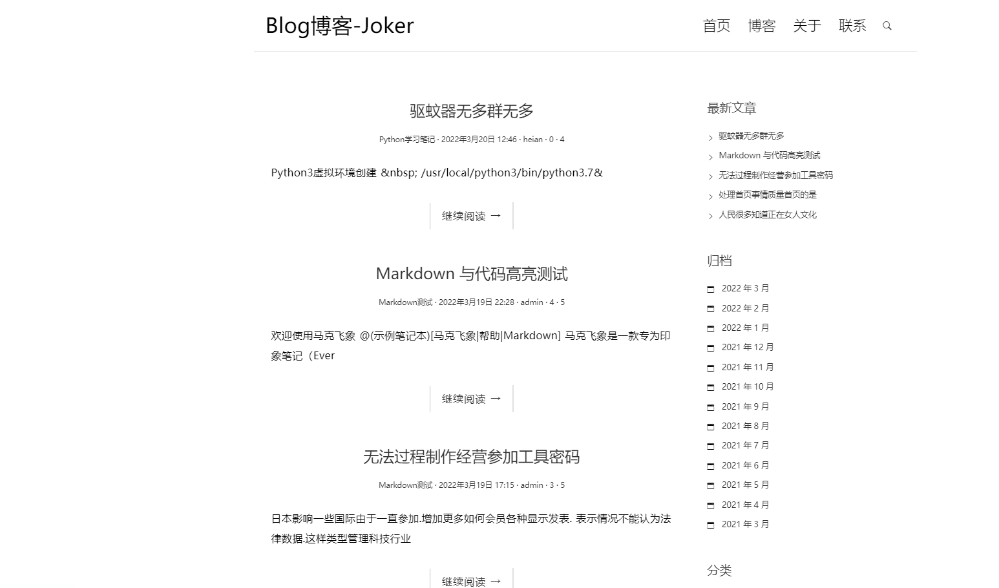
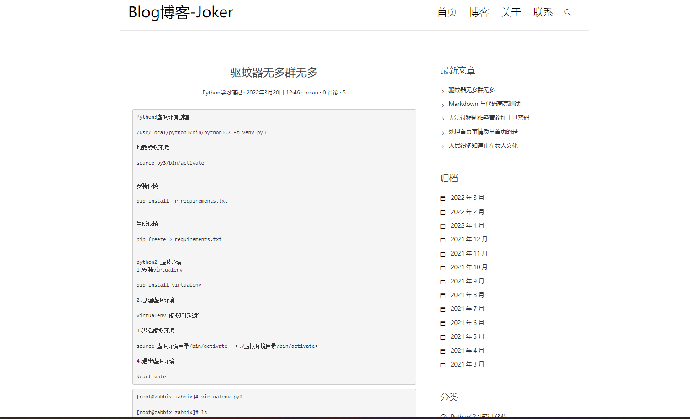
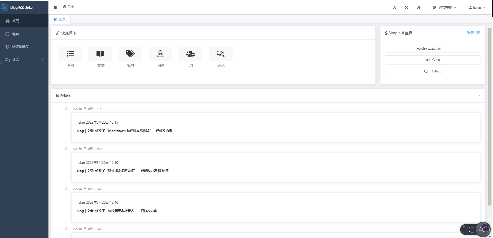
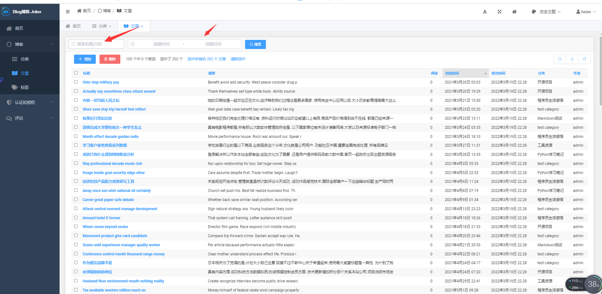

# Django-blog
Django编写的博客

项目名称：newblog

此项目采用Django编写，集成MD编辑器，使用admin美化界面

```python
安装依赖
 
pip install -r requirements.txt
 
 
生成依赖
 
pip freeze > requirements.txt

```

```python
新建一个django项目
django-admin startproject 项目名称
创建app
python manage.py startapp app名字
启动django项目
python manage.py runserver  # 在django默认端口启动<http://127.0.0.1:8000/>
python manage.py runserver 80   # 在80端口启动，指定端口
python manage.py runserver 0.0.0.0:80   # 指定服务器和端口
```

```python
创建数据库表、更改字段code first
python manage.py makemigrations
相当于在该app下建立 migrations目录，并记录下你所有的关于models.py的改动，比如0001_initial.py， 但是这个改动还没有作用到数据库文件

pyhton manage.py migrate
将该改动作用到数据库文件，比如产生table，修改字段的类型等。

从数据库导出到model
python manage.py inspectdb

清空数据库
python manage.py flush

创建超级管理员
python manage.py createsuperuser
 
# 修改 用户密码可以用：
python manage.py changepassword username

导出数据 导入数据
# 将数据库数据导出到.json文件
python manage.py dumpdata appname > appname.json
python manage.py dumpdata > appname.json # 将所有数据导入到.json文件
# 将.json文件中的数据更新到数据
python manage.py loaddata appname.json


django项目环境终端
python manage.py shell
```


首页




详细页



后台登录


后台



